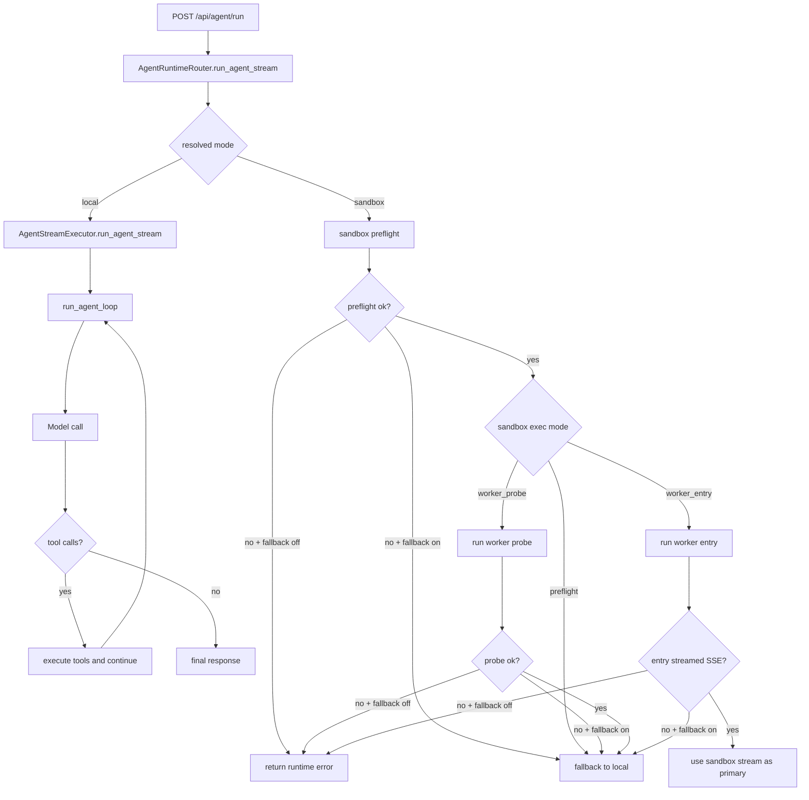

# Agent Runtime and Sandbox

Detailed design of the current single-agent runtime implementation, including when sandbox is used, how fallback works, and how to operate it in production.

## Why This Exists

Agent-Graph supports two runtime backends for single-agent execution:

- `local`: run agent loop directly in MAG process
- `sandbox`: run sandbox preflight (and optional worker execution) via OpenShell

This design provides a safe migration path:

1. keep existing behavior stable (`local` remains default)
2. gradually introduce sandbox lifecycle checks
3. optionally move execution into sandbox worker mode

## Request Entry and Runtime Selection

Runtime selection happens per request in `POST /api/agent/run`.

Request model supports `runtime_mode`:

- `local`
- `sandbox`

Selection priority:

1. request `runtime_mode`
2. global `AGENT_RUNTIME_MODE`
3. fallback to `local` on invalid value

## End-to-End Execution Flow

## Exactly When Sandbox Runs

Sandbox is created only when the resolved mode is `sandbox`.

The trigger point is inside runtime router before entering the local executor:

1. create OpenShell sandbox
2. run preflight command (`python --version`)
3. optionally run worker probe or worker entry script
4. decide whether to continue in sandbox path or fallback to local

Important: application startup does not run agent sandbox execution. Sandbox lifecycle is request-time behavior.

## Sandbox Execution Modes

`AGENT_SANDBOX_EXEC_MODE` controls sandbox behavior.

### 1) preflight

Behavior:

- create sandbox
- run health preflight command
- emit runtime event
- continue in local executor

Use case:

- validating OpenShell availability without changing agent execution semantics

### 2) worker_probe

Behavior:

- do preflight
- run a lightweight Python probe in sandbox
- parse worker stdout as JSON events
- still continue in local executor (current design)

Use case:

- validating payload and sandbox worker protocol safely

### 3) worker_entry

Behavior:

- do preflight
- execute worker entry script in sandbox
- worker internally runs `AgentStreamExecutor`
- host replays worker SSE chunks
- if sandbox streamed successfully, skip local executor to avoid duplicate output

Use case:

- moving primary execution path into sandbox runtime

## Fallback and Failure Policy

`AGENT_RUNTIME_ALLOW_FALLBACK` controls failure handling.

- `true`:
  - preflight/probe/entry failure emits `fallback` runtime event
  - execution continues in local mode
- `false`:
  - runtime error is emitted
  - stream terminates with `[DONE]`

Fallback reasons include:

- `sandbox_unavailable`
- `sandbox_worker_probe_failed`
- `sandbox_worker_entry_failed`

## Runtime SSE Events

Runtime router emits structured SSE messages for observability.

Common event fields:

- `type`: usually `runtime`
- `runtime`: `sandbox` or `local`
- `phase`: execution phase marker
- `sandbox_id`: when available

Typical phases:

- `preflight_ok` / `preflight_failed` / `preflight_error`
- `worker_probe_ok` / `worker_probe_failed`
- `worker_entry_ok` / `worker_entry_failed`
- `fallback`

In `worker_entry`, sandbox worker can emit:

- `worker_entry_start`
- `worker_entry_import_missing`
- `worker_entry_execution_error`
- `worker_sse` (host-side replay to client)

## Local Agent Loop (Shared Core Logic)

Regardless of local path or sandbox worker-entry path, core loop behavior is the same executor logic:

1. build effective config (agent config + request overrides)
2. build messages (system, history, user, memory query)
3. prepare tools (MCP tools + system tools)
4. iterate model call and tool execution until:
   - no tool calls, or
   - `max_iterations` reached
5. persist run result and memory updates
6. stream final `[DONE]`

## Configuration Reference

| Variable | Default | Description |
|---|---|---|
| `AGENT_RUNTIME_MODE` | `local` | Global default runtime mode |
| `AGENT_RUNTIME_ALLOW_FALLBACK` | `true` | Allow fallback to local on sandbox failure |
| `AGENT_SANDBOX_EXEC_MODE` | `preflight` | Sandbox mode: `preflight`, `worker_probe`, `worker_entry` |
| `OPENSHELL_CLUSTER_NAME` | empty | OpenShell cluster target |
| `OPENSHELL_CLIENT_TIMEOUT` | `30` | OpenShell client timeout (seconds) |
| `OPENSHELL_READY_TIMEOUT_SECONDS` | `120` | Sandbox ready timeout (seconds) |
| `OPENSHELL_EXEC_TIMEOUT_SECONDS` | `20` | Command execution timeout in sandbox (seconds) |
| `OPENSHELL_DELETE_ON_EXIT` | `true` | Delete sandbox when context exits |

## Recommended Rollout Strategy

1. Start with `AGENT_RUNTIME_MODE=local` and `AGENT_SANDBOX_EXEC_MODE=preflight` in test env.
2. Switch selected requests to `runtime_mode=sandbox` and observe runtime events.
3. Enable `worker_probe` to validate worker protocol and payload stability.
4. Enable `worker_entry` for canary traffic.
5. Keep `AGENT_RUNTIME_ALLOW_FALLBACK=true` during rollout.
6. After confidence improves, consider disabling fallback for strict sandbox enforcement.

## Operational Checklist

- OpenShell dependency installed and reachable from MAG runtime
- Sandbox image has Python and required runtime dependencies
- `app` import path available in sandbox for worker-entry mode
- SSE transport path allows long-lived streaming
- Logs include runtime phase transitions for incident analysis

## Known Design Characteristics (Current State)

- This is a phased migration architecture, not full sandbox isolation by default.
- In `preflight` and `worker_probe`, effective execution still happens locally.
- `worker_entry` is the first mode where sandbox can become primary execution path.
- Request-level runtime mode allows gradual adoption without global cutover.

## Troubleshooting

### Sandbox not used even when expected

Check:

- request `runtime_mode` is actually `sandbox`
- `AGENT_RUNTIME_MODE` is not overriding expected behavior
- runtime events include `preflight_ok`

### Immediate runtime_error in sandbox mode

Check:

- OpenShell connectivity and credentials
- timeout settings too aggressive
- fallback disabled (`AGENT_RUNTIME_ALLOW_FALLBACK=false`)

### worker_entry succeeds but local still runs

This can happen if worker did not emit replayable `worker_sse` chunks. In that case, router may still proceed with local executor when fallback is allowed.

## Related Pages

- [Agent Config](config.md)
- [Agent Execution Loop](loop.md)
- [System Tools](../tools/index.md)
- [MCP: When to Use](../mcp/when-to-use.md)
