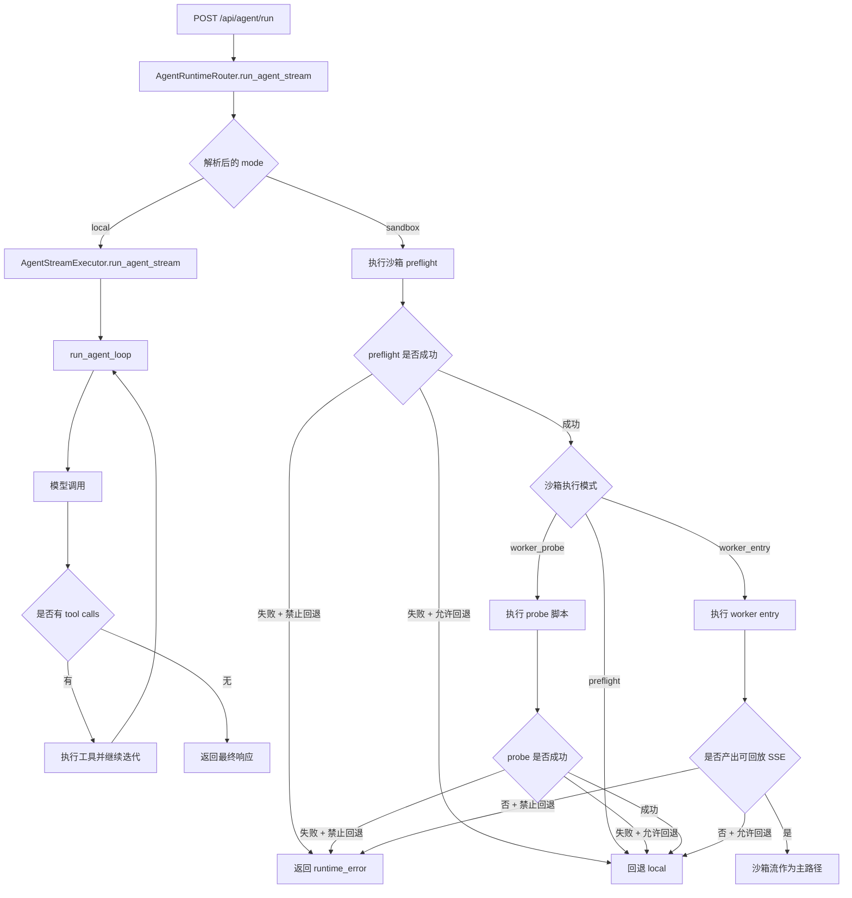

# Agent 运行时与沙箱

本文档描述当前单 Agent 运行时的真实实现: 何时触发沙箱、不同沙箱模式的行为、回退策略，以及生产环境建议。

## 设计目标

单 Agent 运行支持两类后端:

- `local`: 在 MAG 进程内执行 Agent 循环
- `sandbox`: 通过 OpenShell 执行沙箱预检和可选 Worker 执行

该方案采用渐进式迁移:

1. 先保持默认行为稳定（默认 `local`）
2. 引入沙箱可用性预检
3. 逐步将执行主路径迁移到沙箱 Worker

## 请求入口与运行时选择

运行时选择发生在每次 `POST /api/agent/run` 请求中。

请求参数 `runtime_mode` 支持:

- `local`
- `sandbox`

优先级:

1. 本次请求 `runtime_mode`
2. 全局配置 `AGENT_RUNTIME_MODE`
3. 非法值自动回退 `local`

## 端到端流程

## 沙箱到底在什么时候运行

只有解析后的运行模式是 `sandbox` 时，才会创建并使用沙箱。

触发步骤:

1. 创建 OpenShell Sandbox
2. 在沙箱内执行预检命令（`python --version`）
3. 按配置执行 `worker_probe` 或 `worker_entry`
4. 根据执行结果决定继续沙箱路径或回退本地

重要说明:

- 应用启动阶段不会执行 Agent 沙箱逻辑
- 沙箱是请求时行为，不是服务启动时行为

## 沙箱执行模式

由 `AGENT_SANDBOX_EXEC_MODE` 控制。

### 1) preflight

行为:

- 创建沙箱
- 执行预检命令
- 输出 runtime 事件
- 继续走本地执行器

适用:

- 只验证 OpenShell 可用性，不改变执行语义

### 2) worker_probe

行为:

- 执行 preflight
- 在沙箱内运行轻量探针脚本
- 解析 worker stdout 的 JSON 事件
- 目前仍继续走本地执行器

适用:

- 验证 payload 协议和 worker 通道稳定性

### 3) worker_entry

行为:

- 执行 preflight
- 在沙箱内运行 worker entry 脚本
- worker 内部调用 `AgentStreamExecutor`
- 主进程回放 worker 产生的 SSE
- 若沙箱已成功流式输出，跳过本地执行器，避免重复响应

适用:

- 将主执行路径迁移至沙箱

## 失败处理与回退策略

由 `AGENT_RUNTIME_ALLOW_FALLBACK` 控制。

- `true`:
  - preflight/probe/entry 失败时发送 `fallback` 事件
  - 自动切回 `local` 继续执行
- `false`:
  - 返回 `runtime_error`
  - 终止流并输出 `[DONE]`

常见回退原因:

- `sandbox_unavailable`
- `sandbox_worker_probe_failed`
- `sandbox_worker_entry_failed`

## Runtime SSE 事件规范

运行时路由会输出结构化 SSE 事件，便于前端展示与运维观测。

常用字段:

- `type`: 通常为 `runtime`
- `runtime`: `sandbox` 或 `local`
- `phase`: 当前阶段
- `sandbox_id`: 可用时附带

常见 phase:

- `preflight_ok` / `preflight_failed` / `preflight_error`
- `worker_probe_ok` / `worker_probe_failed`
- `worker_entry_ok` / `worker_entry_failed`
- `fallback`

在 `worker_entry` 下，worker 还会输出:

- `worker_entry_start`
- `worker_entry_import_missing`
- `worker_entry_execution_error`
- `worker_sse`（由宿主回放给客户端）

## 本地 Agent 循环（共享核心逻辑）

无论是本地路径，还是 worker_entry 沙箱路径，核心执行逻辑一致:

1. 生成有效配置（Agent 配置 + 请求覆盖）
2. 构造消息（系统消息、历史消息、用户输入、记忆检索）
3. 准备工具（MCP + 系统工具）
4. 模型与工具循环，直到:
   - 本轮无工具调用，或
   - 达到 `max_iterations`
5. 持久化执行结果并更新记忆
6. 返回 `[DONE]`

## 配置项说明

| 变量 | 默认值 | 说明 |
|---|---|---|
| `AGENT_RUNTIME_MODE` | `local` | 全局默认运行时 |
| `AGENT_RUNTIME_ALLOW_FALLBACK` | `true` | 沙箱失败是否允许回退 local |
| `AGENT_SANDBOX_EXEC_MODE` | `preflight` | 沙箱模式: `preflight` / `worker_probe` / `worker_entry` |
| `OPENSHELL_CLUSTER_NAME` | 空 | OpenShell 集群名 |
| `OPENSHELL_CLIENT_TIMEOUT` | `30` | OpenShell 客户端超时（秒） |
| `OPENSHELL_READY_TIMEOUT_SECONDS` | `120` | 沙箱就绪超时（秒） |
| `OPENSHELL_EXEC_TIMEOUT_SECONDS` | `20` | 沙箱命令执行超时（秒） |
| `OPENSHELL_DELETE_ON_EXIT` | `true` | 退出上下文时是否删除沙箱 |

## 推荐落地顺序

1. 测试环境先保持 `AGENT_RUNTIME_MODE=local`，并启用 `preflight` 观察事件。
2. 对小流量请求显式传 `runtime_mode=sandbox`。
3. 切到 `worker_probe` 验证协议、依赖和日志。
4. 再切 `worker_entry` 做灰度。
5. 灰度期间保持 `AGENT_RUNTIME_ALLOW_FALLBACK=true`。
6. 稳定后再评估是否关闭回退，强制沙箱执行。

## 运维检查清单

- MAG 所在环境可访问 OpenShell
- 沙箱镜像具备 Python 与必要依赖
- `worker_entry` 模式下，沙箱内可导入 `app` 代码路径
- SSE 链路支持长连接流式返回
- 日志可追踪 runtime phase 变化

## 当前实现特征

- 当前是阶段式迁移架构，不是默认全量沙箱隔离。
- `preflight` 与 `worker_probe` 模式下，主执行仍在本地。
- `worker_entry` 是首个可将沙箱作为主执行路径的模式。
- 请求级 `runtime_mode` 支持逐步迁移，不需要一次性全局切换。

## 常见问题

### 明明设置了 sandbox，但没有在沙箱执行

检查:

- 请求里是否真的传了 `runtime_mode=sandbox`
- 全局 `AGENT_RUNTIME_MODE` 是否符合预期
- SSE 是否出现 `preflight_ok`

### sandbox 模式立刻返回 runtime_error

检查:

- OpenShell 连通性与权限
- 超时参数是否过小
- 是否关闭了回退（`AGENT_RUNTIME_ALLOW_FALLBACK=false`）

### worker_entry 显示成功，但最终又走了本地

当 worker 未产出可回放的 `worker_sse` 片段时，在允许回退场景下，路由器可能继续本地执行。

## 相关文档

- [Agent 配置](config.zh.md)
- [Agent 执行循环](loop.zh.md)
- [系统工具](../tools/index.zh.md)
- [MCP 何时使用](../mcp/when-to-use.zh.md)
